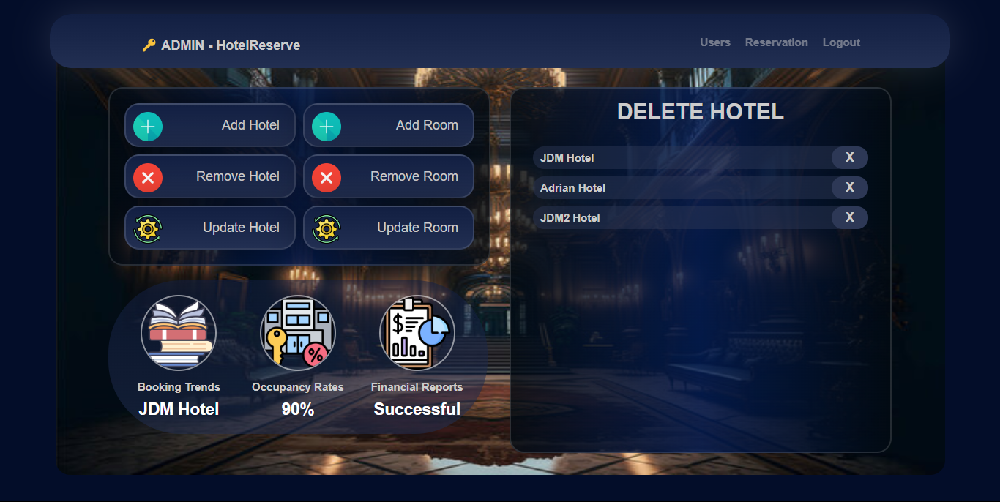
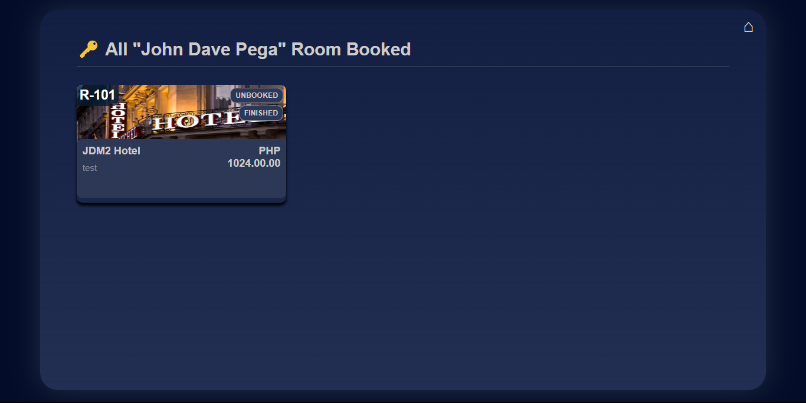

# API Documentation

This is api documentation of our Hotel Reservation System (Fix this)

## Login API (POST)

```php
if ($type === 'login')
{
	$username = $_POST["email"];
	$password = $_POST["pass"];
	if ($username === 'admin' && $password === 'admin')
		redirect_to('./admin/admin.php');
	if (login($username, $password))
		redirect_to('./index.php');
	redirect_to('./registration.php?error=true');
}
```

### Request
```json
{
	"email": "UserEmail",
	"pass" : "HashedPassword"
}
```

### Response
The response depends on the user's role and authentication status:

**Success Response for Admin:**
- **Code:** 302 Found
- **Headers:** `Location: /admin/admin.php`
- **Content:** Redirects the user to the admin dashboard.

**Success Response for Regular User:**
- **Code:** 302 Found
- **Headers:** `Location: /index.php`
- **Content:** Redirects the user to the index page.

**Error Response:**
- **Code:** 302 Found
- **Headers:** `Location: /registration.php?error=true`
- **Content:** Redirects the user to the registration page with an error flag.

---

## Register API (POST)

```php
if ($type === 'register')
{
	$full_name = $_POST["full_name"];
	$username  = $_POST["username"];
	$email     = $_POST["email"];
	$password  = $_POST["password"];
	$cpassword = $_POST["cpassword"];

	if ($password !== $cpassword)
		redirect_to("./registration.php?on=reg&full_name=$full_name&username=$username&email=$email&error=true");

	$pass = password_hash($password, PASSWORD_DEFAULT);
	register($full_name, $username, $email, $pass);
	if (login($username, $password))
		redirect_to('./index.php');

	redirect_to('./registration.php?on=reg');
}
```

### Request
```json
{
	"full_name": "UserFullName",
	"username": "Username",
	"email": "UserEmail",
	"password": "UserPassword",
	"cpassword": "ConfirmPassword"
}

```

### Response

**Success Response:**
- **Code:** 302 Found
- **Headers:** `Location: /index.php`
- **Content:** Redirects the user to the index page.

**Error Response:**
- **Code:** 302 Found
- **Headers:** `Location: /registration.php?error=true&full_name=$full_name&username=$username&email=$email`
- **Content:** Redirects the user to the registration page with an error flag and includes the user's entered data.

**Default Error Response:**
- **Code:** 302 Found
- **Headers:** `Location: /registration.php?on=reg`
- **Content:** Redirects the user to the registration page with an error flag.

---

## Create Hotel/Room API (POST)


```php
if ($type === 'add-hotel')
{
	SQLFunction::addHotel(
		$_POST['img_url'],
		$_POST['name'],
		$_POST['location'],
		$_POST['description']
	);
	redirect_to('./admin/admin.php?type=ahotel');
}
elseif ($type === 'add-room')
{
	SQLFunction::addRoom(
		$_POST['room_number'],
		$_POST['typeID'],
		$_POST['price'],
		$_POST['status'],
		$_POST['hotel_id']
	);
	redirect_to('./admin/admin.php?type=aroom');
}
```

### Request
```json
{
	"add-hotel": {
		"img_url": "Image URL of Hotel",
		"name" : "Name of the Hotel",
		"location" : "Location of the Hotel",
		"description" : "Description of the Hotel"
	},
	"add-room": {
		"room_number": "Number of Room",
		"typeID" : "Standard, Suit, etc.",
		"price" : "Price of the Room",
		"status" : "Status of the Room (Available, Booked, Out of Service)",
		"hotel_id" : "Hotel ID for Hotel"
	}
}
```

### Response

**Success Response for Add Hotel:**
- **Code:** 302 Found
- **Headers:** `Location: /admin/admin.php?type=ahotel`
- **Content:** Redirects the user to the admin dashboard with an add hotel flag.

**Success Response for Add Room:**
- **Code:** 302 Found
- **Headers:** `Location: /admin/admin.php?type=aroom`
- **Content:** Redirects the user to the admin dashboard with an add room flag.

---

## Delete Hotel/Room API (POST)


```php
if ($type === 'del-hotel')
{
	SQLFunction::removeHotel($_POST['hotel_id']);
	redirect_to('./admin/admin.php?type=dhotel');
}
elseif ($type === 'del-room')
{
	SQLFunction::removeRoom($_POST['room_id']);
	redirect_to('./admin/admin.php?type=droom');
}
```

### Request
```json
{
	"del-hotel": {
		"hotel_id": "Hotel ID to Delete"
	},
	"del-room": {
		"room_id": "Room ID to Delete"
	}
}
```

### Response

**Success Response for Delete Hotel:**
- **Code:** 302 Found
- **Headers:** `Location: /admin/admin.php?type=dhotel`
- **Content:** Redirects the user to the admin dashboard with an delete hotel flag.

**Success Response for Delete Room:**
- **Code:** 302 Found
- **Headers:** `Location: /admin/admin.php?type=droom`
- **Content:** Redirects the user to the admin dashboard with an delete room flag.

---

## Update Hotel/Room API (POST)


```php
if ($type === 'upd-hotel')
{
	SQLFunction::updHotel(
		$_POST['img_url'],
		$_POST['name'],
		$_POST['location'],
		$_POST['description'],
		$_POST['hotel_id']
	);
	redirect_to('./admin/admin.php?type=uhotel');
}
elseif ($type === 'upd-room')
{
	SQLFunction::updRoom(
		$_POST['room_number'],
		$_POST['typeID'],
		$_POST['price'],
		$_POST['status'],
		$_POST['hotel_id'],
		$_POST['room_id']
	);
	redirect_to('./admin/admin.php?type=uroom');
}
```

### Request
```json
{
	"upd-hotel": {
		"img_url": "Image URL of Hotel",
		"name" : "Name of the Hotel",
		"location" : "Location of the Hotel",
		"description" : "Description of the Hotel",
		"hotel_id" : "Hotel ID to Update"
	},
	"upd-room": {
		"room_number": "Number of Room",
		"typeID" : "Standard, Suit, etc.",
		"price" : "Price of the Room",
		"status" : "Status of the Room (Available, Booked, Out of Service)",
		"hotel_id" : "Hotel ID for Hotel",
		"room_id" : "Room ID to Update"
	}
}
```

### Response

**Success Response for Update Hotel:**
- **Code:** 302 Found
- **Headers:** `Location: /admin/admin.php?type=uhotel`
- **Content:** Redirects the user to the admin dashboard with an update hotel flag.

**Success Response for Update Room:**
- **Code:** 302 Found
- **Headers:** `Location: /admin/admin.php?type=uroom`
- **Content:** Redirects the user to the admin dashboard with an update room flag.

---

## Booking and Unbooking (Unbook | Finish) API (POST)


```php
if ($type === 'book-room')
{
	$session = new Session();
	$user_id = $session->get('user_id'); // First get the userID
	SQLFunction::bookRoom(
		$user_id,
		$_POST['room_id'],
		$_POST['check_in'],
		$_POST['check_out']
	);
	redirect_to('./dashboard.php?success-book=true');
}
elseif ($type === 'unbook-room')
{
	SQLFunction::unBookRoom($_POST['reserve_id'], $_POST['room_id']);
	redirect_to('./users.php');
}
elseif ($type === 'unbook-room-finish')
{
	SQLFunction::unBookRoom($_POST['reserve_id'], $_POST['room_id']);
	redirect_to('./users.php?finish=true');
}
```

### Request
```json
{
	"book-room": {
		"room_id": "Room ID to Book Reservation and Update status to Booked",
		"check_in" : "Check In Time of User",
		"check_out" : "Check Out Time of User",
	},
	"unbook-room": {
		"reserve_id": "Reservation ID to Unbook",
		"room_id" : "Room ID to Update the status to Available"
	},
	"unbook-room-finish": {
		"reserve_id": "Reservation ID to Finish",
		"room_id" : "Room ID to Update the status to Available"
	}
}
```

### Response

**Success Response for Booking a Room:**
- **Code:** 302 Found
- **Headers:** `Location: /dashboard.php?success-book=true`
- **Content:** Redirects the user to the admin dashboard with an sucess-book flag.

**Success Response for Unbooking Room Book:**
- **Code:** 302 Found
- **Headers:** `Location: /users.php`
- **Content:** Redirects the user to User Dashboard.

**Success Response for Finishing Room Book:**
- **Code:** 302 Found
- **Headers:** `Location: /users.php?finish=true`
- **Content:** Redirects the user to User Dashboard with an finish flag.

---