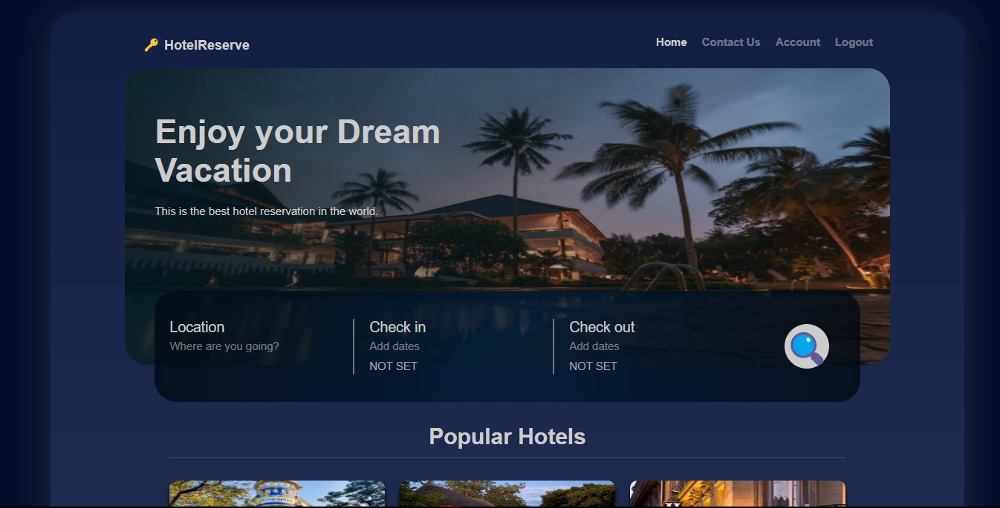
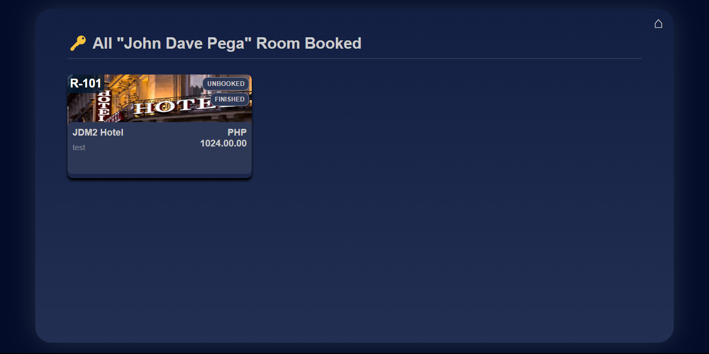
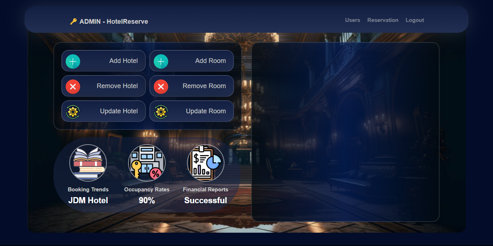

# Hotel Reservation System Overview

The Hotel Reservation System is designed to facilitate real-time hotel booking and management for users and administrators.
- GITHUB LINK: [Hotel Reservation Github](https://github.com/JDM-Github/PHP---Hotel-Reservation-System)
- PROJECT LINK: [Hotel Reservation Project](https://drive.google.com/drive/folders/1IpkrJUT_pcw1ZlR7W5y5pfiTmone-5fd?usp=drive_link)
- VIEW: [Hotel Reservation View](https://drive.google.com/drive/folders/1M9rYJjZYzzC24L3eNbk9vwpV3R3ZUdW7?usp=drive_link)
- VIDEO: [Hotel Reservation Presentation](https://drive.google.com/file/d/1tycTj-Q4Ilq6mQGd9x8dm2lCzbc5Hby4/view?usp=sharing)

## User Features


- **View Hotels**: Users can browse a list of available hotels.
- **Book Rooms**: Users can book rooms in their chosen hotels.
- **Manage Bookings**: Users can view all their bookings, cancel them, and mark their stay as finished.
- **Feedback**: Users can provide feedback for their stay after it has been completed.

## Admin Features

- **Dashboard**: Admins have a dedicated dashboard for managing the system.
- **Hotel and Room Management**: Admins can add, delete, and update hotels and rooms.
- **User Management**: Admins can view all users and have the ability to ban users.
- **Reservation Management**: Admins can view all reservations made in the system.
- **Analytics**: The admin dashboard includes real-time analytics at the bottom left corner.

The entire system operates in real-time, ensuring that all data and interactions are promptly updated and reflected across the platform.


## Setup Instructions

### Dependencies
Ensure you have the following dependencies installed on your system:
- PHP
- MySQL
- Apache
- XAMPP

### Installation
1. Clone the repository to your local machine.
2. Place the project folder in the XAMPP `htdocs` directory.
3. Start Apache and MySQL from the XAMPP control panel.
4. Import the provided SQL file into your MySQL database to set up the necessary tables.

### Configuration
1. Open `config.php` in the include folder.
2. Set your database credentials:
    ```php
    define('DB_SERVER', 'localhost');
    define('DB_USERNAME', 'root');
    define('DB_PASSWORD', '');
    define('DB_NAME', 'your_database_name');
    ```

### Connecting Frontend with Backend
The frontend and backend are connected using PHP's `require_once` keyword. This ensures that backend components are included wherever needed in the frontend.

- The `public` folder contains files that are accessible via the web.
- The `include` folder contains backend logic, including database connection and session management.

### Folder Structure
- **public/**: Contains all visible elements of the website.
    - `index.php`: Main entry point, redirects the user to the appropriate section.
    - `admin/`: Contains administration-related files.
    - `css/`: Contains stylesheets.
    - `layouts/`: Contains the layout templates for the website.
- **include/**: Contains backend components.
    - `functions.php`: Contains various helper functions.
    - `session.php`: Manages session handling.
    - `database.php`: Handles database connections and queries.

### API Communication
- `redirect.php`: This file handles communication with the backend APIs.
- The backend APIs include functionalities for:
    - Adding hotel/room
    - Removing hotel/room
    - Updating hotel/room
    - Booking/unbooking
    - Login/registering

### SQL Functions Class
A dedicated class has been created to manage SQL functions, encapsulating the following operations:
- Adding hotel/room
- Removing hotel/room
- Updating hotel/room
- Booking/unbooking
- Login/registering

## Usage
After setting up the project, navigate to `http://localhost/your_project_folder/public/index.php` in your web browser to access the website.

## Troubleshooting
- Ensure that Apache and MySQL are running via the XAMPP control panel.
- Verify your database credentials in `config.php`.
- Check file permissions if you encounter access issues.

# MIT License

Permission is hereby granted, free of charge, to any person obtaining a copy
of this software and associated documentation files (the "Software"), to deal
in the Software without restriction, including without limitation the rights
to use, copy, modify, merge, publish, distribute, sublicense, and/or sell
copies of the Software, and to permit persons to whom the Software is
furnished to do so, subject to the following conditions:

The above copyright notice and this permission notice shall be included in all
copies or substantial portions of the Software.

THE SOFTWARE IS PROVIDED "AS IS", WITHOUT WARRANTY OF ANY KIND, EXPRESS OR
IMPLIED, INCLUDING BUT NOT LIMITED TO THE WARRANTIES OF MERCHANTABILITY,
FITNESS FOR A PARTICULAR PURPOSE AND NONINFRINGEMENT. IN NO EVENT SHALL THE
AUTHORS OR COPYRIGHT HOLDERS BE LIABLE FOR ANY CLAIM, DAMAGES OR OTHER
LIABILITY, WHETHER IN AN ACTION OF CONTRACT, TORT OR OTHERWISE, ARISING FROM,
OUT OF OR IN CONNECTION WITH THE SOFTWARE OR THE USE OR OTHER DEALINGS IN THE
SOFTWARE.

---

**Authors:**
- John Dave Pega
- Adrian Catindig
